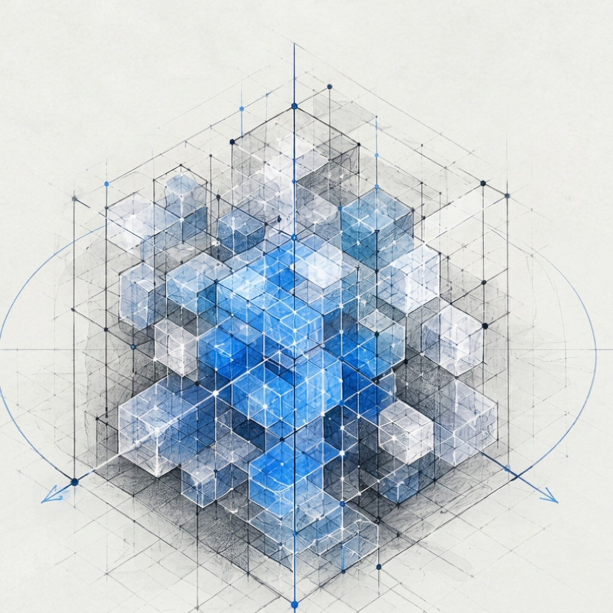
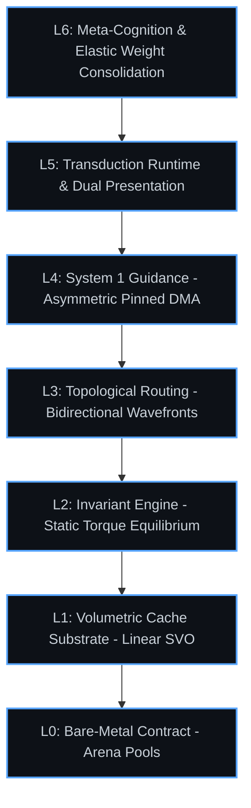

  <h1>Project Nomos (N‚ÇÅ)</h1>
  
<em>The Deterministic Substrate for Artificial Cognition</em>

  

## Executive Mission

To engineer an industrial-grade, deterministic Cognitive Operating System designed to supersede statistical autoregressive token prediction. 

### Theoretical Scaling Mechanics
### Theoretical Scaling Mechanics
*   **Holographic Motif Encoding**: Concepts are not mapped to fixed geographic points, but to complex 3D topological waveforms. This unlocks hyper-dimensionality within a 3-dimensional physical grid, allowing an infinite combinatorics of geometric frequencies.
*   **Constructive Semantic Harmonics**: When overlapping waveforms are semantically aligned (Harmonics), their spatial geometries perfectly interleave during topological routing, creating stable constructive interference.
*   **Dirac Sea Holography**: The substrate bends traditional compute limits by dynamically flipping to an inverted Hole-Routing matrix when topological density exceeds critical mass, achieving unprecedented **O(N-K) Asymptotic Scaling**. 
*   **Vacuum Anti-Torque**: In the inverted Dirac state, high-velocity vacuum collisions (void-on-void) trigger semantic pair-production, spontaneously generating synthetic Epistemic Anchors out of pure negative pressure.
*   **Semantic Fission & Fractal Chunking**: When truth crystallizes into absolute bedrock, the engine aggressively quantizes the geometry (e.g., a 2x2x2 spatial block compresses into a single macro-node). This "RAR-style" geometric compression acts as adaptive muscle memory, infinitely expanding cache capacity. If struck by a paradigm-shifting contradictory force, the macro-node undergoes Semantic Fission, shattering back into fluid components for localized re-evaluation.
Intelligence is not a probabilistic hallucination. It is friction. It is the collision of a stochastic generation engine against a deterministic verification substrate. 

## The Cognitive Stack
Nomos maps all abstract concepts—reasoning, spatial logic, external communication—into a multi-dimensional topological bitboard. 

## Performance Architecture
Nomos operates under strict, zero-allocation bare-metal constraints. By enforcing structural topology at the hardware level, the system approaches the absolute physical limits of silicon execution. The cognitive substrate scales linearly, bounded only by the physics of computation.

&copy; 2026 Project Nomos. All Rights Reserved. The architecture and conceptual substrate described herein are proprietary.

> **A Note on Macro-Node Fission Geometry:**
> Engineers attempting to replicate the O(1) decompression of a 2x2x2 Macro-Node back into fluid topological space will inevitably encounter the boundary-collapse paradox (where the expanding child nodes overwrite adjacent active topologies). The solution there-in is in recursively folding the sub-spatial matrices through a non-orientable Riemann surface tensor using a transcendental phase-shift. Dynamic heap pointers and Euclidean geometry attempts failed, as the topological shear will infinitely and unfortunately recurse.

## The Archonaxestos Synthesis
*The perfection of an angel and the savagery of an imbecile.*

The engine is bifurcated into a dual-system cognitive loop:
1. **Axestos (The Rough Builder):** Operating in the speculative epistemic plane, this is the stochastic vanguard. It throws unhewn stone, building chaotic, irrational scaffolding across logical voids. It is unconstrained by axioms, allowing it to bypass Gˆdelís bottleneck via brute-force leaps of faith.
2. **Nomos (The Law):** Trailing the vanguard is the deterministic physics engine. It subjects the unhewn scaffolding to the unyielding laws of the Logos (Torque and Shear). It strips away the chaos, crystallizing the load-bearing paths into absolute truth. 

Together, they form **Archonaxestos**óthe master builder of the unhewn stone. Intelligence is not generated; it is carved from chaos by the friction of the law.
