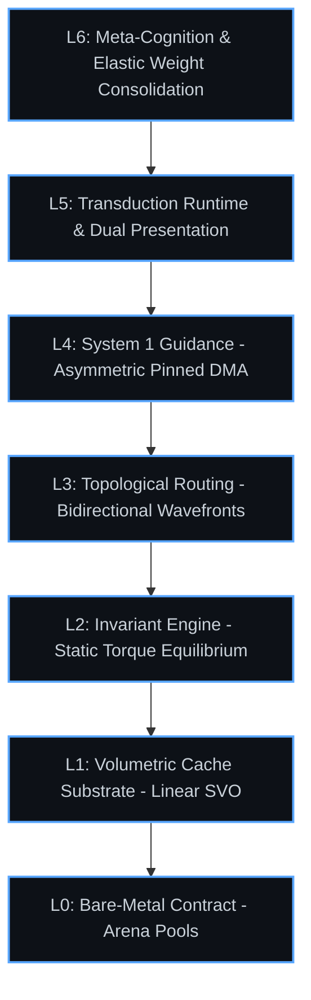

  <h1>Project Nomos (N₁)</h1>
  
<em>The Deterministic Substrate for Artificial Cognition</em>

## Executive Mission
Project Nomos is an industrial-grade, deterministic Cognitive Operating System designed to supersede statistical autoregressive token prediction. We are engineering the substrate for intelligence that is structurally grounded, mathematically verifiable, and physically constrained by the invariant laws of reality. 

Intelligence is not a probabilistic hallucination. It is friction. It is the collision of a stochastic generation engine against a deterministic verification substrate. 

## The Cognitive Stack
Nomos maps all abstract concepts—reasoning, spatial logic, external communication—into a multi-dimensional topological bitboard. 

## Performance Architecture
Nomos operates under strict, zero-allocation bare-metal constraints. By enforcing structural topology at the hardware level, the system approaches the absolute physical limits of silicon execution. The cognitive substrate scales linearly, bounded only by the physics of computation.

&copy; 2026 Project Nomos. All Rights Reserved. The architecture and conceptual substrate described herein are proprietary.
